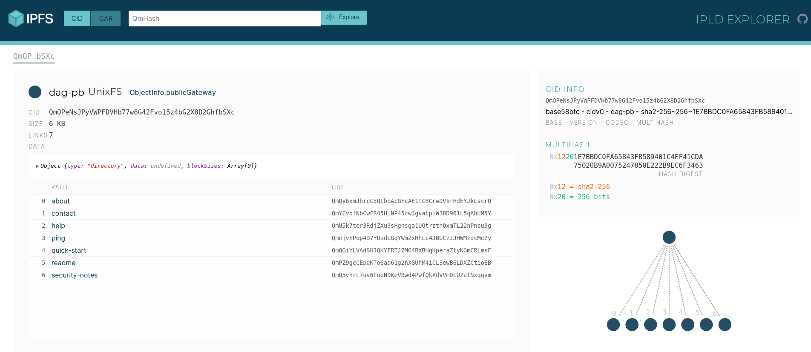

# [IPFS](https://ipfs.io)

## [Docker run](https://docs.ipfs.tech/how-to/run-ipfs-inside-docker/)

## Install

Follow [install instructions](https://docs.ipfs.tech/install/) or do

```sh
chmod +x ../scripts/install.sh
./../scripts/install_ipfs.sh
```

## About

```sh
$ ipfs cat /ipfs/QmQPeNsJPyVWPFDVHb77w8G42Fvo15z4bG2X8D2GhfbSXc/about

                  IPFS -- Inter-Planetary File system

IPFS is a global, versioned, peer-to-peer filesystem. It combines good ideas
from Git, BitTorrent, Kademlia, SFS, and the Web. It is like a single bit-
torrent swarm, exchanging git objects. IPFS provides an interface as simple
as the HTTP web, but with permanence built-in. You can also mount the world
at /ipfs.

IPFS is a protocol:
- defines a content-addressed file system
- coordinates content delivery
- combines Kademlia + BitTorrent + Git

IPFS is a filesystem:
- has directories and files
- mountable filesystem (via FUSE)

IPFS is a web:
- can be used to view documents like the web
- files accessible via HTTP at `http://ipfs.io/<path>`
- browsers or extensions can learn to use `ipfs://` directly
- hash-addressed content guarantees the authenticity

IPFS is modular:
- connection layer over any network protocol
- routing layer
- uses a routing layer DHT (kademlia/coral)
- uses a path-based naming service
- uses BitTorrent-inspired block exchange

IPFS uses crypto:
- cryptographic-hash content addressing
- block-level deduplication
- file integrity + versioning
- filesystem-level encryption + signing support

IPFS is p2p:
- worldwide peer-to-peer file transfers
- completely decentralized architecture
- **no** central point of failure

IPFS is a CDN:
- add a file to the filesystem locally, and it's now available to the world
- caching-friendly (content-hash naming)
- BitTorrent-based bandwidth distribution

IPFS has a name service:
- IPNS, an SFS inspired name system
- global namespace based on PKI
- serves to build trust chains
- compatible with other NSes
- can map DNS, .onion, .bit, etc to IPNS
```

## Exploring

### [IPLD](https://ipld.io/)

Interplanetary Linked Data

- [IPLD docs](https://ipld.io/docs/)
- [IPLD explorer](https://explore.ipld.io/#/explore/)
  - [Visualize content links](https://explore.ipld.io/#/explore/QmQPeNsJPyVWPFDVHb77w8G42Fvo15z4bG2X8D2GhfbSXc)



### `ipfs ls`

```sh
$ ipfs ls /ipfs/QmQPeNsJPyVWPFDVHb77w8G42Fvo15z4bG2X8D2GhfbSXc
QmQy6xmJhrcC5QLboAcGFcAE1tC8CrwDVkrHdEYJkLscrQ 1681 about
QmYCvbfNbCwFR45HiNP45rwJgvatpiW38D961L5qAhUM5Y 189  contact
QmU5k7ter3RdjZXu3sHghsga1UQtrztnQxmTL22nPnsu3g 311  help
QmejvEPop4D7YUadeGqYWmZxHhLc4JBUCzJJHWMzdcMe2y 4    ping
QmQGiYLVAdSHJQKYFRTJZMG4BXBHqKperaZtyKGmCRLmsF 1681 quick-start
QmPZ9gcCEpqKTo6aq61g2nXGUhM4iCL3ewB6LDXZCtioEB 1091 readme
QmQ5vhrL7uv6tuoN9KeVBwd4PwfQkXdVVmDLUZuTNxqgvm 1162 security-notes
```

### `ipfs get`

```sh
ipfs get /ipfs/QmQPeNsJPyVWPFDVHb77w8G42Fvo15z4bG2X8D2GhfbSXc/readme
```

### [IPFS browser](https://ipfsbrowser.com/) API

No ipfs node required

```sh
curl "https://api.ipfsbrowser.com/ipfs/get.php?hash=QmVpGhL5qr56KFfSZPyivH9Zsx5ppNUREWH4RAuq3HeoSL"
```

### [Http gateway](https://docs.ipfs.tech/reference/http/gateway/#api)

No ipfs node required

```sh
curl "http://127.0.0.1:8080/ipfs/bafybeigdyrzt5sfp7udm7hu76uh7y26nf3efuylqabf3oclgtqy55fbzdi" > creepy_cat.jpg
"
```
